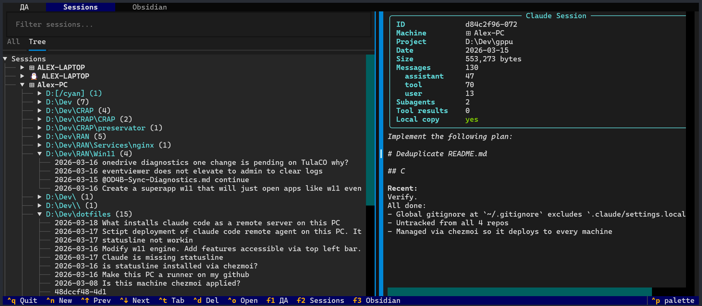
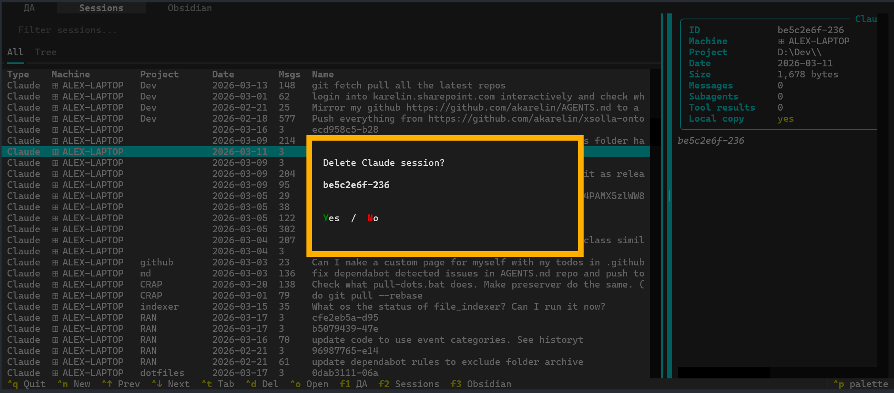
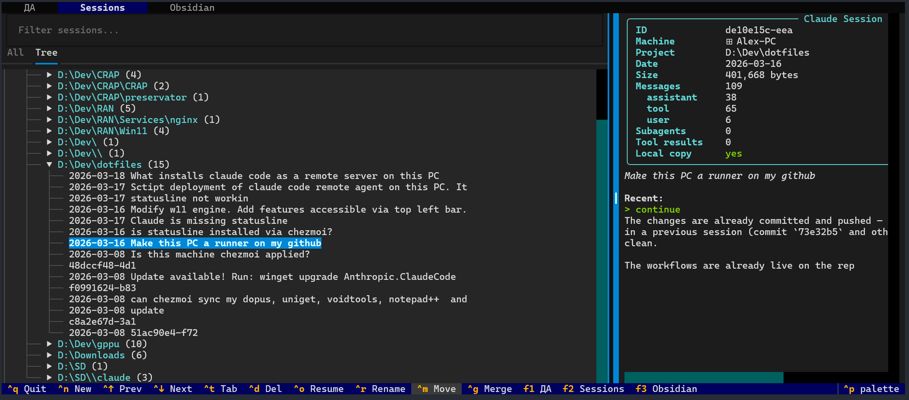
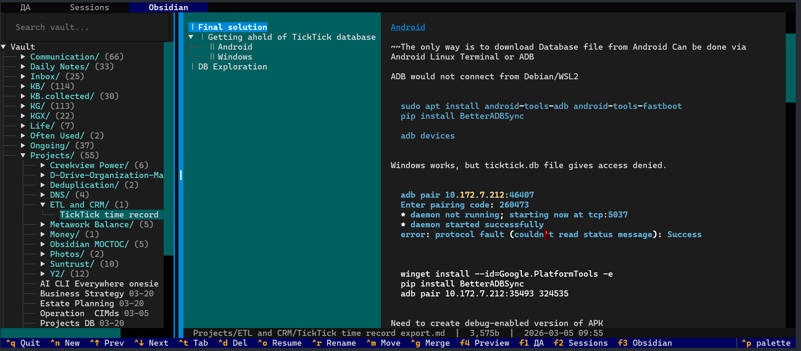
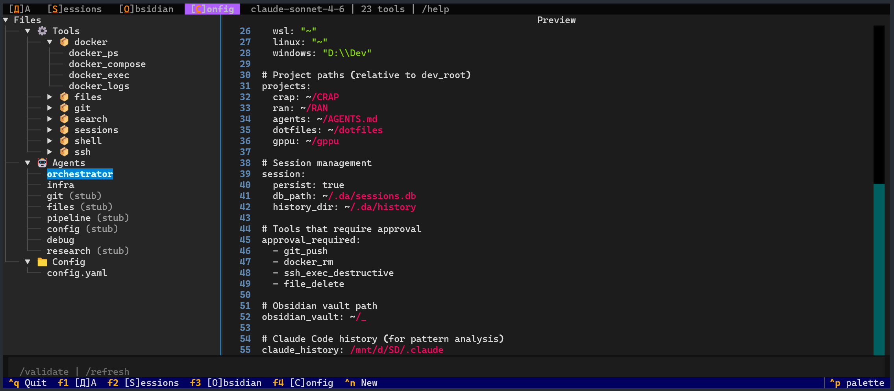
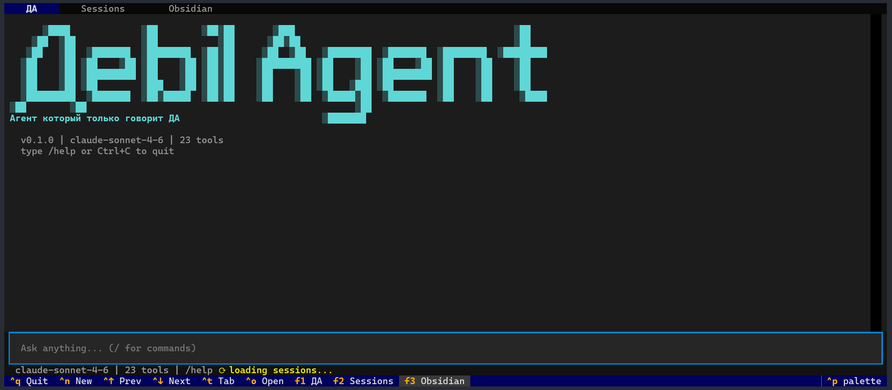

# MCP United

**Plugin version 2.0.2. MCP United runtime version 2.0.0.**

A private ChatGPT, Codex, and Claude plugin marketplace. It publishes one
plugin containing one skill: MCP United.

[](#mcp-united)

## Quick Start

```bash
# Claude Code
claude plugin marketplace add akarelin/A
claude plugin install mcp-united@mcp-united --scope user

# Codex
codex plugin marketplace add akarelin/A
codex plugin add mcp-united@mcp-united
```

ChatGPT desktop and Claude users add `akarelin/A` as a personal marketplace,
install MCP United, start a new task or chat, and complete the Entra sign-in.
ChatGPT web manages the MCP connection but does not add the repository
marketplace source.

---

> Current marketplace scope: only MCP United is published. The `core`,
> `manage`, `organize`, `develop`, `work`, `administer`, and `research`
> bundles documented below are preserved under `RAN/Skills/4review` and are
> not marketplace entries.

## Core Concepts

### Plugins

A **plugin** is the distribution unit — a `.plugin` zip containing skills, scripts, MCP server definitions, and commands. Each plugin has a `plugin.json` manifest and lives under `plugins/<name>/`.

```
plugin-name/
├── .claude-plugin/plugin.json    # Manifest (name, version, description)
├── skills/                       # Skill definitions (SKILL.md files)
├── scripts/                      # Bundled Python/Shell implementations
├── commands/                     # Slash commands (.md files)
├── .mcp.json                     # MCP server definitions (optional)
└── README.md
```

### Skills

A **skill** is defined by a single `SKILL.md` file with YAML frontmatter. It is the atomic unit of capability — a set of instructions that tells Claude how to accomplish a specific task.

```yaml
---
name: work-m365
description: "Microsoft 365: Mail, Calendar, Teams, Files, Tasks"
user-invocable: true
---
```

The description doubles as the trigger — Claude reads it to decide when to invoke the skill.

### Meta-Skills (Routing & Dispatch)

A **meta-skill** is a skill that performs no work itself. It acts as a router: its `SKILL.md` contains a routing table that tells Claude which sub-skill to invoke based on context.

Example — the `work` meta-skill routes like this:

| Request mentions | Routes to |
|---|---|
| Outlook, Exchange, Teams, OneDrive | `work-m365` |
| TickTick tasks | `work-ticktick` |
| Ambiguous "email" | Asks the user |

There is no hardcoded dispatcher. Routing is natural language in markdown — Claude reads the routing section and makes a judgment call. This makes the system flexible and context-aware without requiring code changes.

### Nesting & Hierarchy

Skills nest up to two levels:

```
Meta-skill (router)
└── Concrete skill (does work)
    └── Nested workflow (sub-task within a skill)
```

Real example:

```
work/                              ← meta-skill (routes by platform)
├── work-m365/                     ← concrete skill (MCP United)
└── work-ticktick/                 ← concrete skill (MCP United)
```

Deeper nesting is intentionally avoided to keep the mental model simple.

### Connections (MCP Servers)

MCP United is the single remote connection for Key Vault, Microsoft 365,
Entra, Obsidian, TickTick, and OpenViking:

| Endpoint | URL | Catalog |
|---|---|---|
| MCP United | `https://mcp.karelin.ai/mcp` | 82 canonical `system_action` tools |

The runtime is maintained in the private infrastructure repository. This
repository contains the public marketplace package, client manifests, skills,
and canonical tool catalog. Entra users receive delegated Microsoft 365 tools;
the gateway's privileged role adds the other systems.

### Reusable Agents

Skills and their scripts are designed to be reusable across plugins. The `manage-skills` skill provides a full lifecycle for plugin development: review feedback, patch, test, rebuild `.plugin` zip, deploy. Version tracking is enforced — every change bumps the patch version in both `plugin.json` and `SKILL.md` frontmatter.

---

## Using Plugins in Claude Code

Install MCP United via `/plugin install mcp-united@mcp-united`. Once installed,
its skill appears in Claude's available skill list.

**How dispatch works**: When you say "check my Jira backlog", Claude matches your request against installed skill descriptions, loads the `work` meta-skill, reads its routing table, and dispatches to `work-atlassian`. No slash commands needed — just describe what you want.

**Explicit invocation** is also supported:
```
/skill work-atlassian
/skill search
/skill organize
```

---

## Available Plugins (8)

This section preserves the legacy bundle documentation. Only the
`mcp-united` entry is currently published.

### core
**v0.3.1** — Core agent primitives: memory, sessions, skills, agents, learning, and Obsidian daily notes.

| Sub-skill | Description |
|---|---|
| `core` | Meta-skill entry point for agentic primitives |
| `memory` | Persistent file-based memory system |
| `session` | Claude Code session inspection and resume |
| `skill` | Skill authoring and lifecycle |
| `agent` | Subagent definitions |
| `compose-agent` | Compose multi-step agent workflows |
| `learn` | Mistake-driven improvement loop |
| `obsidian-daily` | Read and update the daily note through MCP United |

### manage
**v0.2.0** — Session and skill management: sync, list, resume, patch, test, deploy.

| Sub-skill | Description |
|---|---|
| `manage` | Lifecycle for plugin skills and Claude Code sessions |

### organize
**v0.3.0** — File organizer with sub-skill discovery. Scans a folder, runs each sub-skill in `--scan` (dry-run) mode, presents a combined plan, waits for approval.

| Sub-skill | Description |
|---|---|
| `organize` | Meta-skill router across organizers |
| `organize-arxiv` | Identify arXiv PDFs, fetch metadata, rename, move to library |
| `organize-scan` | Generic scan triage |
| `organize-scan-medical` | Convert medical scans into a bilingual EN/RU Obsidian vault |

### develop
**v0.1.0** — Developer tooling.

| Sub-skill | Description |
|---|---|
| `gppu` | gppu framework support |
| `rewrite-history` | Git history rewriting |

### work
**v0.2.3** — Workplace productivity hub. Routes to the right platform based on your request.

| Sub-skill | Description |
|---|---|
| `work` | Meta-skill router across workplace platforms |
| `work-m365` | Mail, Calendar, Teams, Files, Tasks, Contacts, OneNote, Presence (self-hosted M365 MCP) |
| `work-ticktick` | TickTick task management (self-hosted TickTick MCP) |

### administer
**v0.1.2** — Read-only Entra directory inspection and Portainer stack deploys.

| Sub-skill | Description |
|---|---|
| `administer` | Meta-skill router across admin domains |
| `admin-m365` | Entra users, groups, licenses, devices, roles, domains, and organization details |
| `admin-portainer` | Portainer Docker stack deploys for the karel.in fleet |

### research
**v0.1.3** — Search and data exploration across Obsidian, Microsoft 365, Everything, OpenViking, and Neo4j.

| Sub-skill | Description |
|---|---|
| `research` | Meta-skill router across research backends |
| `search` | Knowledge search across Obsidian, Microsoft 365, Everything, and OpenViking |
| `data` | Neo4j Cypher queries and SQL exploration |

### mcp-united
**v2.0.2** — Entra-authenticated MCP United connection and canonical
cross-system workflow skill for ChatGPT, Codex, and Claude.

| Sub-skill | Description |
|---|---|
| `mcp-united` | Route reads, searches, and authorized changes through the unified MCP catalog |

---

## Contributing

To contribute a new skill:

1. Fork the repo
2. Create `plugins/<parent>/skills/<your-skill>/SKILL.md` with frontmatter
3. Add implementation scripts under `plugins/<parent>/scripts/`
4. Update `plugins/<parent>/.claude-plugin/plugin.json` and the top-level `.claude-plugin/marketplace.json`
5. Open a PR

---

## Earlier Projects

This repository evolved from a series of earlier experiments in agentic tooling. For historical context:

| Project | Status | Description |
|---|---|---|
| **DA (ДА)** | Active — see [DA/](DA/) | Multi-agent CLI/TUI built on Anthropic SDK. Sessions, tools, remote hosts. |
| **Gadya (Гадя)** | Active — see [Gadya/](Gadya/) | Voice-first iOS/Android assistant (React Native / Expo) |
| ~~AGENTS.md pattern~~ | ~~Superseded by plugins~~ | ~~Single markdown file to control agent behavior per repo~~ |
| ~~Multi-agent orchestration~~ | ~~Superseded by meta-skills~~ | ~~Specialized subagents (changelog, docs, archive, validation, push) coordinated by parent agent~~ |
| ~~Mistake-driven improvement~~ | ~~Folded into manage-skills~~ | ~~Agents log mistakes; patterns feed back into instructions~~ |
| ~~DAPY CLI~~ | ~~Abandoned~~ | ~~LangChain/LangGraph CLI for agentic workflows~~ |
| ~~Agent swarm~~ | ~~Abandoned~~ | ~~ORCHESTRATOR.md-based multi-agent experiments~~ |
| ~~Subagent definitions~~ | ~~Replaced by skills/~~ | ~~Standalone .md agent specs in agents/ directory~~ |
| ~~Archive templates~~ | ~~Inlined~~ | ~~README, AGENTS, archive templates in archive/templates/~~ |

---

```
MCP United — ChatGPT, Codex, and Claude Plugin Marketplace
plugin v2.0.2 / runtime v2.0.0
```

---

```
      ░████             ░██        ░██░██       ░███                                        ░██
    ░██  ░██            ░██           ░██      ░██░██                                       ░██
   ░██   ░██  ░███████  ░████████  ░██░██     ░██  ░██   ░████████  ░███████  ░████████  ░████████
  ░██    ░██ ░██    ░██ ░██    ░██ ░██░██    ░█████████ ░██    ░██ ░██    ░██ ░██    ░██    ░██
  ░██    ░██ ░█████████ ░██    ░██ ░██░██    ░██    ░██ ░██    ░██ ░█████████ ░██    ░██    ░██
  ░██    ░██ ░██        ░███   ░██ ░██░██    ░██    ░██ ░██   ░███ ░██        ░██    ░██    ░██
  ░█████████  ░███████  ░██░█████  ░██░██    ░██    ░██  ░█████░██  ░███████  ░██    ░██     ░████
░██        ░██                                                 ░██
Агент который только говорит ДА                          ░███████
```
Multiple workstations, dozens of projects, across hundereds of instances of Claude Code/Gemini/Codex. No problem.
Tired of CLI agents asking for permissions in Approve All mode, but afraid to go YOLO. No problem.

[](https://github.com/akarelin/AGENTS.md/actions/workflows/da-build.yml) [](https://github.com/akarelin/AGENTS.md/releases?q=da)<br>
[](https://github.com/akarelin/AGENTS.md/actions/workflows/gadya-android.yml) [](https://github.com/akarelin/AGENTS.md/releases?q=gadya)<br>
[](https://github.com/akarelin/AGENTS.md/actions/workflows/dapy-build.yml) [](https://github.com/akarelin/AGENTS.md/releases?q=dapy)<br>

An unfinished, evolving collection of everything agentic — prompt engineering patterns, autonomous agent instructions, multi-agent orchestration experiments, and tooling. This is a working dumping ground, not a polished framework.

## Table of Contents
- [In development](#in-development)
  - [DA (ДА)](#da-да)
  - [Gadya (Гадя)](#gadya-гадя)
- [No longer developed](#no-longer-developed)
  - [DAPY CLI](#dapy-cli)
- [What's where](#whats-where)

## In development
- **DA (ДА)**: Personal multi-agent CLI and TUI built directly on the Anthropic SDK. Multi-session support, tool execution, Claude session browsing, and remote host management.
- **Gadya (Гадя)**: A voice-first iOS/Android mobile assistant built with React Native / Expo and TypeScript. Designed for hands-free, one-handed interaction with LLMs — speak a question, get an AI answer read aloud, and optionally save or search personal notes via voice.
- ~~**DAPY CLI**: A more ambitious attempt to wrap the whole workflow into a LangChain-based CLI tool~~

---

# DA (ДА) - Агент который только говорит ДА

Superagent to manage cli coding agents, projects, tools. Makes Claude Code compliant (not asking too many questions).

## Features
### Session Management
Browse sessions across multiple machines. 
<p align="center"></p>

Delete, rename, move and merge.

<p align="center"></p>

The tree expands to show full session history with timestamps. Selected sessions show recent conversation messages and available actions in the detail panel.

<p align="center"></p>

### Obsidian Integration

Obsidian vault integrated. Used to manage Projects - an abstraction above sessions.

<p align="center"></p>

### Editor

A tree-based browser for tools, agents, and YAML config files. Da can be fully configured from its own ui or using its own chat interface.

<p align="center"></p>

### REPL
<p align="center"></p>


### CLI Commands

| Command | Description |
|---------|-------------|
| `da` | Launch full TUI (default) |
| `da rich` | Rich TUI — 5-tab layout with Projects, Chat, Sessions, Obsidian, Config |
| `da tui` | Sidebar TUI — session list + conversation layout |
| `da repl` | Interactive REPL with slash commands and tab completion |
| `da manage` | Session manager — browse, rename, copy, move, delete |
| `da ask "<query>"` | One-shot query to the orchestrator agent |
| `da sessions` | List recent sessions |
| `da resume <id>` | Resume a previous session |
| `da analyze` | Analyze Claude Code conversation history |
| `da diag` | Show diagnostic info (model, hosts, tools) |
| `da next` | Read 2Do.md, ROADMAP.md, git status — recommend what to do |
| `da close` | Close session — update 2Do.md, document progress |
| `da document` | Generate CHANGELOG.md from git diff |
| `da push [msg]` | Commit and push with changelog verification |

Flags: `--model / -m` (model override), `--debug`, `--config / -c`.

### Tools (23)

| Category | Tools |
|----------|-------|
| Shell | `shell_exec` — run arbitrary commands |
| Git | `git_status`, `git_diff`, `git_log`, `git_commit_push` |
| Docker | `docker_ps`, `docker_logs`, `docker_exec`, `docker_compose` |
| SSH | `ssh_exec`, `ssh_batch` (parallel multi-host) |
| Files | `read_file`, `write_file`, `list_dir`, `find_files`, `delete_file`, `copy_file`, `move_file`, `edit_file` |
| Search | `grep_search`, `glob_find` |
| Sessions | `list_sessions`, `get_session`, `delete_session` |

### REPL Shortcuts

Slash commands in the REPL and TUI input:

| Command | Action |
|---------|--------|
| `/model [opus\|sonnet\|haiku]` | Switch model or show current |
| `/tools` | List all available tools |
| `/hosts` | Show configured remote hosts |
| `/git [status\|diff\|log\|commit\|push]` | Git operations |
| `/docker [ps\|logs\|exec\|up\|down]` | Docker operations |
| `/ssh <host> [cmd]` | Execute on remote host |
| `/grep <pattern>`, `/find <glob>` | Search files |
| `/cat <path>`, `/ls [path]` | Read file / list directory |
| `/sessions`, `/switch <id>`, `/delete [id]` | Session management |
| `/compact` | Summarize and trim conversation context |
| `!<command>` | Direct shell execution |

Tab completion for commands, model names, hosts, git/docker subcommands, and file paths.

### Keyboard Shortcuts

| Key | Action |
|-----|--------|
| `F1`–`F5` | Switch views: Projects, Chat, Sessions, Obsidian, Config |
| `Ctrl+N` | New session |
| `Ctrl+Q` | Quit |
| `Esc` | Back / close editor |

---

See [Gadya/README.md](Gadya/README.md) for full documentation.

---


## What's where

```
.
├── AGENTS.md                  → Master instructions for autonomous agents (Claude, Gemini, etc.)
├── CLAUDE.md / GEMINI.md      → Per-LLM instruction pointers
│
├── DA/                       → Personal multi-agent CLI/TUI (Anthropic SDK)
│   ├── da/                   → Python package (cli, tui, agents, tools)
│   ├── scripts/              → Install script
│   └── config.yaml           → Model, hosts, session settings
│
├── DAPY/                → LangChain/LangGraph CLI for agentic workflows
│   ├── dapy/            → Python package (orchestrator, tools, middleware)
│   ├── deployment/            → Docker, GCP, LangChain Cloud configs
│   └── tools/                 → LLM log ingestion and querying
│
├── Gadya/                     → Voice-first mobile assistant (React Native / Expo)
│   ├── app/                   → Expo app screens and navigation
│   ├── server/                → Express + tRPC backend with LangChain chains
│   ├── hooks/                 → Voice system, continuous listening
│   └── services/              → LLM integration, notes, storage
│
├── agents/                    → Moved to kar1024/archive-A (history preserved)
│
└── archive/                   → Moved to kar1024/archive-A (history preserved)
```

## No longer developed
- **AGENTS.md as a pattern**: A single markdown file that tells any LLM agent how to behave in a repository — session management, git workflow, mistake tracking, changelog conventions
- **Multi-agent orchestration**: Experiments with specialized subagents (changelog, docs, archive, validation, push) coordinated by a parent knowledge-management agent
- **Mistake-driven improvement**: Agents log their own mistakes; those patterns feed back into better instructions


## DAPY CLI

See [DAPY/README.md](DAPY/README.md) for full documentation.

---


```                          
      ░████                     ░███    
    ░██  ░██                   ░██░██                      
   ░██   ░██                  ░██  ░██  
  ░██    ░██       _    _ _  ░█████████               _   
  ░██    ░██   ___| |__(_) | ░██    ░██  __ _ ___ _ _| |_ 
  ░██    ░██  / -_) '_ \ | | ░██    ░██ / _` / -_) ' \  _|
  ░█████████  \___|_.__/_|_| ░██    ░██ \__, \___|_||_\__|
░██        ░██                           |___/             
Агент который только говорит ДА
```
